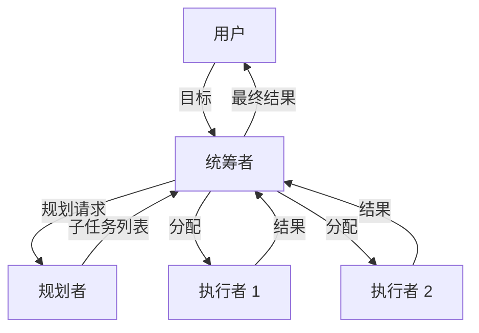
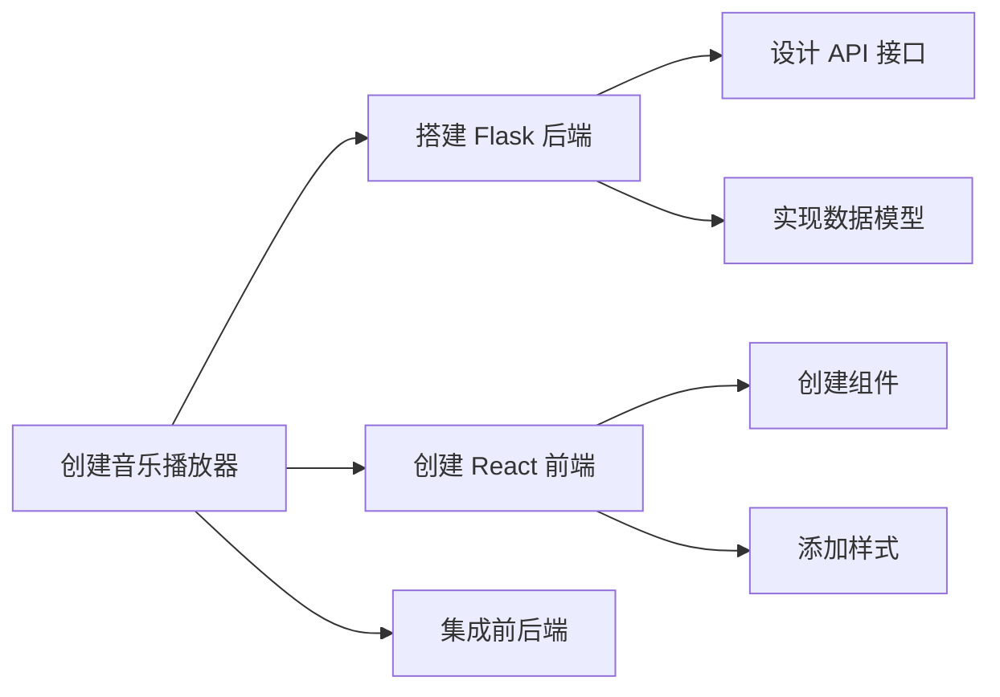
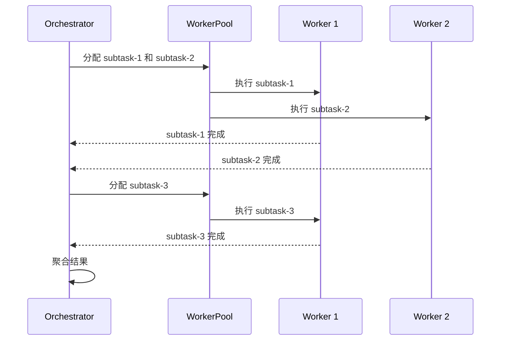
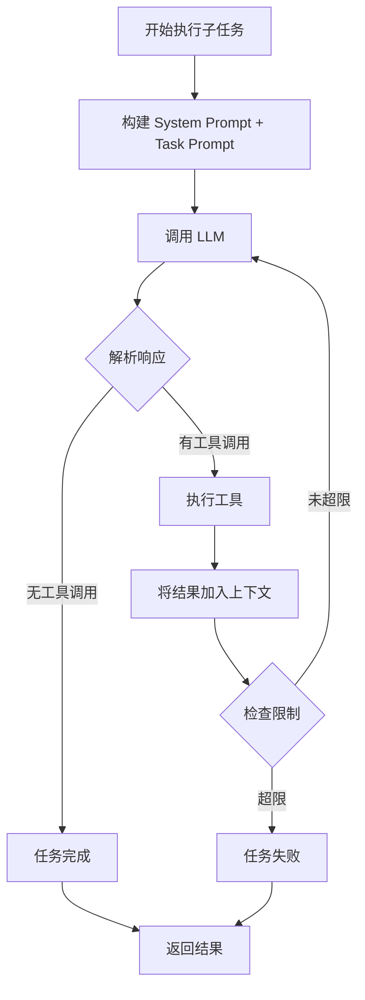
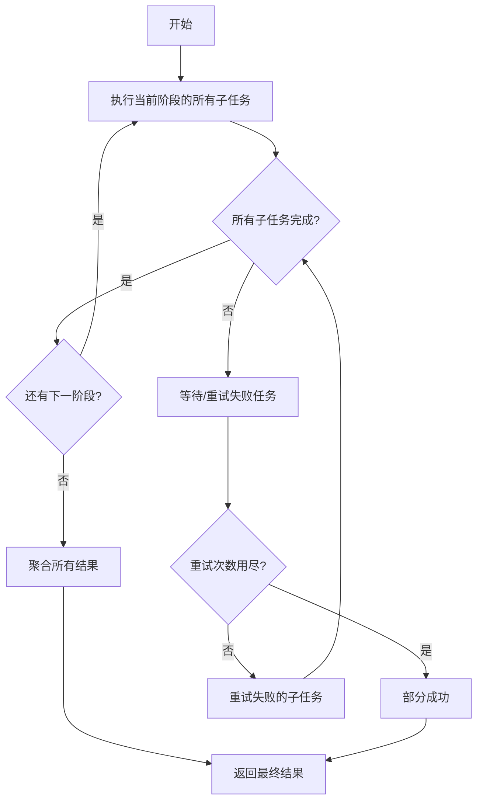
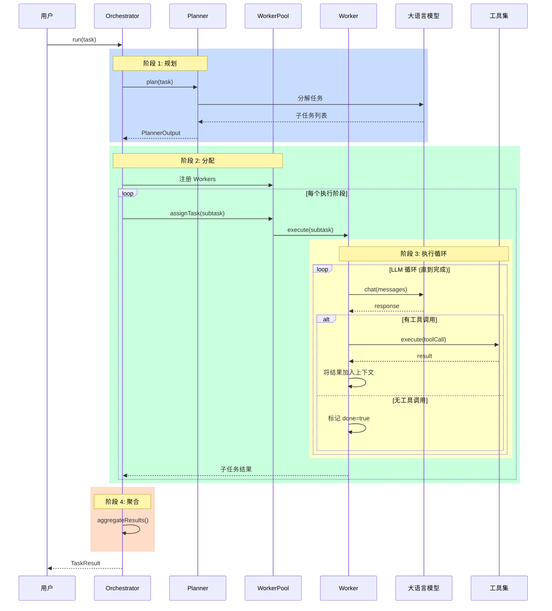

# Tachikoma 架构与执行流程详解

> 面向初学者的完整指南：理解 Tachikoma 如何一步步完成任务

## 目录

1. [核心概念](#核心概念)
2. [整体架构](#整体架构)
3. [执行流程详解](#执行流程详解)
4. [任务完成判定机制](#任务完成判定机制)
5. [如何保持不偏离目标](#如何保持不偏离目标)
6. [完整执行循环图解](#完整执行循环图解)

---

## 核心概念

Tachikoma 采用 **多智能体架构**，核心角色如下：

| 角色       | 类名                               | 职责                         |
| ---------- | ---------------------------------- | ---------------------------- |
| **统筹者** | `Orchestrator`                     | 任务规划、分配、监控、聚合   |
| **规划者** | `Planner`                          | 分解高层任务为可执行的子任务 |
| **执行者** | `WorkerExecutor` + `WorkerBackend` | 执行具体子任务，调用工具     |



---

## 整体架构

### 一、统筹者 (Orchestrator)

**文件**: `packages/core/src/orchestrator/orchestrator.ts`

统筹者是系统的"大脑"，负责 **plan → assign → aggregate** 主流程：

```typescript
// Orchestrator 核心方法
class Orchestrator {
  async run(task: OrchestratorTask): Promise<TaskResult> {
    // 1. plan: 调用 Planner 分解任务
    // 2. assign: 将子任务分配给 Worker
    // 3. monitor: 监控执行进度
    // 4. aggregate: 聚合所有结果
  }
}
```

### 二、规划者 (Planner)

**文件**: `packages/core/src/planner/planner.ts`

规划者将一个高层目标分解为多个可并行或顺序执行的子任务：

```typescript
// Planner 核心输出
interface PlannerOutput {
  subtasks: SubTask[]; // 子任务列表
  executionPlan: {
    // 执行计划
    phases: Phase[]; // 执行阶段（可并行的任务组）
    criticalPath: string[]; // 关键路径
  };
  delegationConfig: {
    // 委托配置
    workerCount: number; // 需要多少 Worker
    mode: 'parallel' | 'sequential';
  };
}
```

### 三、执行者 (Worker)

**文件**: `packages/core/src/worker/worker-executor.ts` + `backends/`

Worker 是实际干活的角色，通过 LLM 循环完成任务：

```typescript
// WorkerExecutor 核心流程
class WorkerExecutor {
  async *execute(subtask: SubTask, tools: Tool[]): AsyncIterable<WorkerMessage> {
    // 将 SubTask 转换为 WorkerTask
    // 调用 Backend 执行
    // 流式返回消息
  }
}
```

---

## 执行流程详解

### 阶段 1: 任务规划 (Planning)

当你给 Tachikoma 一个目标，例如：

```
"创建一个 React + Flask 的音乐播放器应用"
```

**Planner 会这样分解**：



**规划结果示例**：

```json
{
  "subtasks": [
    { "id": "subtask-1", "objective": "搭建 Flask 后端 API", "dependencies": [] },
    { "id": "subtask-2", "objective": "创建 React 前端界面", "dependencies": [] },
    { "id": "subtask-3", "objective": "集成前后端", "dependencies": ["subtask-1", "subtask-2"] }
  ],
  "executionPlan": {
    "phases": [
      { "name": "Phase 1", "subtaskIds": ["subtask-1", "subtask-2"] },
      { "name": "Phase 2", "subtaskIds": ["subtask-3"] }
    ]
  }
}
```

### 阶段 2: 任务分配 (Assignment)

Orchestrator 根据 `executionPlan` 分配任务：

1. **并行阶段**: 同一 Phase 内的任务可以同时分配给多个 Worker
2. **顺序阶段**: 等待依赖任务完成后再分配



### 阶段 3: 子任务执行 (Worker 内部循环)

这是最核心的部分！每个 Worker 内部运行一个 **LLM 循环**：



**关键代码** (简化版)：

```typescript
// GenericAgentBackend.execute() 简化逻辑
async *execute(task: WorkerTask, tools: Tool[]) {
  const context = new ContextManager();
  let done = false;
  let round = 0;

  while (!done && round < maxThinkingRounds) {
    round++;

    // 1. 调用 LLM
    const response = await this.llmClient.chat(context.getMessages());

    // 2. 解析工具调用
    const toolCalls = parseToolCalls(response);

    if (toolCalls.length > 0) {
      // 3. 执行工具
      for (const call of toolCalls) {
        const result = await executeTool(call, tools);
        context.addToolResult(call.id, result);

        yield { type: 'tool_result', tool: call.name, result };
      }
    } else {
      // 4. 没有工具调用 = 任务完成！
      done = true;
    }

    // 5. 检查资源限制
    if (tokensUsed > maxTokens || round >= maxRounds) {
      done = true;
    }
  }

  yield { type: 'complete', output: context.getFinalOutput() };
}
```

---

## 任务完成判定机制

### Worker 层面：何时认为子任务完成？

**核心判定逻辑** (`generic-agent-backend.ts` 第 740 行)：

```typescript
} else {
  // 没有工具调用，任务完成
  done = true;
}
```

**完成条件**（满足任一）：

| 条件                       | 说明                                 |
| -------------------------- | ------------------------------------ |
| **LLM 不再调用工具**       | 模型认为任务已完成，直接输出最终答案 |
| **达到 maxThinkingRounds** | 超过最大思考轮数（默认 30 轮）       |
| **达到 maxToolCalls**      | 超过最大工具调用次数                 |
| **达到 maxTotalTokens**    | 超过 Token 预算                      |
| **致命错误**               | 不可重试的错误导致终止               |

### Orchestrator 层面：何时认为整个任务完成？



**判定代码**（简化）：

```typescript
// Orchestrator.executeWithPlan()
for (const phase of executionPlan.phases) {
  const phaseSubtasks = getSubtasksForPhase(phase);

  // 并行执行该阶段的所有子任务
  const results = await Promise.all(phaseSubtasks.map((subtask) => this.executeSubtask(subtask)));

  // 检查是否有失败
  const failed = results.filter((r) => !r.success);
  if (failed.length > 0) {
    // 尝试重试...
  }
}

// 所有阶段完成 = 任务完成
return this.aggregateResults(allResults);
```

---

## 如何保持不偏离目标

Tachikoma 通过多层机制确保 Agent 不偏离目标：

### 1. 目标传播 (parentObjective)

```
用户目标 → Orchestrator.objective
         → SubTask.parentObjective
         → WorkerTask.parentObjective
         → System Prompt 中
```

每个 Worker 的 System Prompt 都包含原始目标：

```
你正在执行的任务是：创建 React 前端界面
这是更大目标的一部分：创建一个 React + Flask 的音乐播放器应用

请始终牢记大目标，确保你的工作与之一致。
```

### 2. 约束条件 (Constraints)

每个子任务都有明确的约束：

```typescript
interface SubTask {
  objective: string; // 子任务目标
  constraints: string[]; // 必须遵守的约束
  acceptanceCriteria?: string; // 完成标准
}
```

### 3. 偏离检测 (Deviation Detection)

Orchestrator 定期检查执行是否偏离计划：

```typescript
// orchestrator.ts
private startDeviationDetection(): void {
  this.deviationTimer = setInterval(() => {
    this.checkDeviation();
  }, deviationCheckInterval);
}

private checkDeviation(): void {
  // 检查：
  // 1. 子任务是否超时
  // 2. Worker 是否无响应
  // 3. 资源消耗是否异常
}
```

### 4. 子任务复审 (Subtask Refinement)

执行前，Planner 可以复审子任务是否需要进一步拆分：

```typescript
// 如果子任务太大，自动拆分
const refineResult = await planner.refineSubtask({
  objective: subtask.objective,
  maxSubtasks: 4,
});

if (refineResult.shouldSplit) {
  // 替换为更小的子任务
  subtasks = refineResult.subtasks;
}
```

### 5. 技能匹配 (Skills Matching)

根据任务内容自动激活相关技能，注入专业指导：

```typescript
// skills-manager.ts
const matchedSkills = this.matchSkills(task.objective + ' ' + task.parentObjective);

// 将技能内容注入 System Prompt
systemPrompt += renderSkillsSection(matchedSkills);
```

---

## 完整执行循环图解



---

## 总结

| 问题                       | 答案                                                               |
| -------------------------- | ------------------------------------------------------------------ |
| Tachikoma 如何一步步前进？ | Planner 将大任务分解为小任务，Worker 通过 LLM 循环逐个工具调用推进 |
| 如何不偏离目标？           | `parentObjective` 传播、约束条件、偏离检测、技能匹配               |
| 如何知道任务完成？         | Worker: LLM 不再调用工具；Orchestrator: 所有子任务完成             |
| 整个循环是什么？           | **plan → assign → execute(LLM循环) → aggregate**                   |

---

## 相关文件

- 统筹者:
  [orchestrator.ts](file:///Users/hjqcan/Documents/tachikoma/packages/core/src/orchestrator/orchestrator.ts)
- 规划者:
  [planner.ts](file:///Users/hjqcan/Documents/tachikoma/packages/core/src/planner/planner.ts)
- Worker 执行器:
  [worker-executor.ts](file:///Users/hjqcan/Documents/tachikoma/packages/core/src/worker/worker-executor.ts)
- 通用后端:
  [generic-agent-backend.ts](file:///Users/hjqcan/Documents/tachikoma/packages/core/src/worker/backends/generic-agent-backend.ts)
- 类型定义: [types.ts](file:///Users/hjqcan/Documents/tachikoma/packages/core/src/types.ts)
