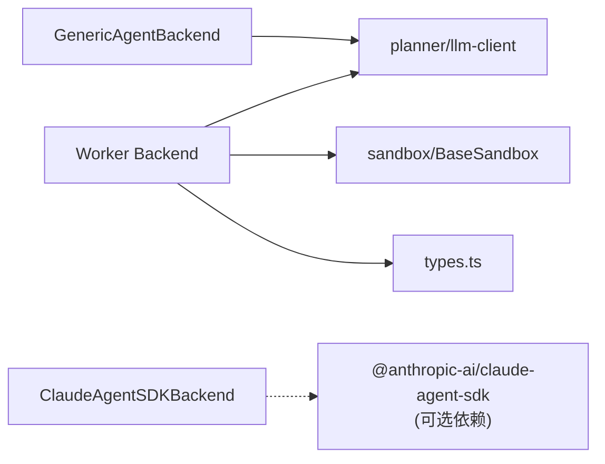
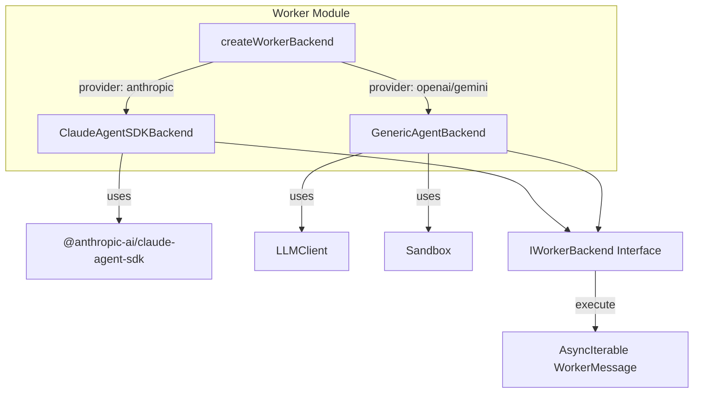

# Worker Backend 混合架构技术文档

## 1. 概述

Worker Backend 是 Tachikoma 任务 5.4 的核心架构实现，采用**混合后端**策略：

| 模型提供商             | 后端实现              | 特点                                          |
| ---------------------- | --------------------- | --------------------------------------------- |
| Anthropic (Claude)     | ClaudeAgentSDKBackend | 使用官方 Agent SDK，获得 Claude Code 完整能力 |
| OpenAI / Gemini / 其他 | GenericAgentBackend   | 自研通用实现，保持多模型灵活性                |

这种设计既能在使用 Claude 时获得最佳效果，又不会锁定到单一模型厂商。

---

## 2. 架构设计

### 2.1 模块结构

```
packages/core/src/worker/
├── index.ts                          # 模块导出入口
├── types.ts                          # 类型定义
├── backend-factory.ts               # 后端工厂
└── backends/
    ├── claude-agent-backend.ts      # Claude Agent SDK 后端
    └── generic-agent-backend.ts     # 通用后端
```

### 2.2 核心接口

```typescript
interface IWorkerBackend {
  readonly provider: string;
  readonly backendType: 'agent-sdk' | 'generic';

  execute(
    task: WorkerTask,
    tools: Tool[],
    options: WorkerExecutionOptions
  ): AsyncIterable<WorkerMessage>;

  getCapabilities(): WorkerCapability[];
  isAvailable(): boolean;
  interrupt(): Promise<void>;
  dispose(): Promise<void>;
}
```

### 2.3 消息流

Worker Backend 通过 `AsyncIterable<WorkerMessage>` 返回执行过程中的消息流：

```typescript
type WorkerMessage =
  | { type: 'thinking';    content: string }           // 思考过程
  | { type: 'tool_call';   tool: string; input: unknown; callId: string }  // 工具调用
  | { type: 'tool_result'; tool: string; result: unknown; success: boolean }  // 工具结果
  | { type: 'output';      content: string }           // 最终输出
  | { type: 'error';       error: string; retryable: boolean }  // 错误
  | { type: 'status';      status: WorkerStatus }      // 状态变更
  | { type: 'approval_request'; ... }                   // 审批请求
```

---

## 3. 后端实现详解

### 3.1 ClaudeAgentSDKBackend

封装 `@anthropic-ai/claude-agent-sdk`，动态导入 SDK 以支持可选安装：

```typescript
class ClaudeAgentSDKBackend implements IWorkerBackend {
  async *execute(task, tools, options) {
    // 动态导入 Claude Agent SDK（可选依赖）
    const sdk = await import('@anthropic-ai/claude-agent-sdk');

    const result = sdk.query({
      prompt: task.objective,
      options: {
        cwd: options.workDir,
        permissionMode: 'bypassPermissions',
        mcpServers: this.convertToolsToMCPServers(tools),
      },
    });

    // 转换 SDK 消息为统一格式
    for await (const sdkMessage of result) {
      yield this.transformSDKMessage(sdkMessage);
    }
  }
}
```

**能力**：代码执行、文件操作、Shell 命令、Web 搜索、浏览器自动化、MCP 工具

### 3.2 GenericAgentBackend

自研实现，使用 LLMClient + 工具调用循环：

```typescript
class GenericAgentBackend implements IWorkerBackend {
  async *execute(task, tools, options) {
    const context = new SimpleContextManager();

    while (!done && round < MAX_ROUNDS) {
      // 1. 调用 LLM
      const response = await this.llmClient.complete(request);
      yield { type: 'thinking', content: response.content };

      // 2. 解析工具调用
      if (containsToolCall(response.content)) {
        for (const call of parseToolCalls(response.content)) {
          yield { type: 'tool_call', ... };

          // 3. 执行工具
          const result = await this.executeTool(call, tools);
          yield { type: 'tool_result', ... };

          context.addToolResult(call.callId, result);
        }
      } else {
        done = true;
        yield { type: 'output', content: response.content };
      }
    }
  }
}
```

**工具调用格式支持**：

- XML 格式：`<tool_use><name>...</name><input>...</input></tool_use>`
- JSON 格式：`{"tool": "name", "input": {...}}`

---

## 4. 使用指南

### 4.1 基本用法

```typescript
import { createWorkerBackend } from '@tachikoma/core/worker';

// Claude 模型自动使用 Agent SDK
const backend = await createWorkerBackend({
  provider: 'anthropic',
  model: 'claude-3-5-sonnet-20241022',
  apiKey: process.env.ANTHROPIC_API_KEY,
});

// 执行任务
const task = { id: 'task-1', objective: 'Read and summarize README.md', ... };
for await (const msg of backend.execute(task, tools, {})) {
  console.log(`[${msg.type}]`, msg);
}

await backend.dispose();
```

### 4.2 强制使用通用后端

```typescript
const backend = await createWorkerBackend({
  provider: 'anthropic',
  model: 'claude-3-5-sonnet-20241022',
  useAgentSDK: false, // 强制使用通用后端
});
```

### 4.3 自定义 LLM Client

```typescript
const backend = new GenericAgentBackend({
  provider: 'custom',
  model: 'my-model',
  llmClient: myCustomLLMClient, // 注入自定义客户端
});
```

---

## 5. 配置说明

### 5.1 ClaudeAgentSDKBackendConfig

| 字段                      | 类型          | 说明                                             |
| ------------------------- | ------------- | ------------------------------------------------ |
| provider                  | `'anthropic'` | 固定为 anthropic                                 |
| model                     | string        | Claude 模型名称                                  |
| apiKey                    | string        | Anthropic API Key                                |
| useAgentSDK               | boolean       | 是否使用 Agent SDK（默认 true）                  |
| sdkOptions.permissionMode | string        | 权限模式: `default`, `auto`, `bypassPermissions` |
| sdkOptions.systemPrompt   | string        | 自定义系统提示                                   |

### 5.2 GenericBackendConfig

| 字段        | 类型      | 说明                        |
| ----------- | --------- | --------------------------- |
| provider    | string    | LLM 提供商                  |
| model       | string    | 模型名称                    |
| apiKey      | string    | API Key                     |
| llmClient   | LLMClient | 可选，注入自定义 LLM 客户端 |
| sandbox     | Sandbox   | 可选，注入沙盒实例          |
| maxTokens   | number    | 最大 Token 数（默认 4096）  |
| temperature | number    | 温度参数（默认 0.3）        |

---

## 6. 安全特性

### 6.1 高风险操作审批

GenericAgentBackend 内置高风险操作检测：

```typescript
// 高风险工具列表
const highRiskTools = ['delete_file', 'rm', 'execute_shell', 'run_command'];

// 危险模式检测
const dangerousPatterns = ['rm -rf', 'delete', 'drop database', 'truncate'];
```

启用审批：

```typescript
for await (const msg of backend.execute(task, tools, {
  requireApproval: true,
  onApprovalRequest: async (request) => {
    // 返回 true 批准，false 拒绝
    return await askUserForApproval(request);
  },
})) { ... }
```

### 6.2 执行中断

```typescript
// 中断当前执行
await backend.interrupt();
```

---

## 7. 测试覆盖

| 测试类别            | 测试数量 | 覆盖内容                                                 |
| ------------------- | -------- | -------------------------------------------------------- |
| 类型辅助函数        | 8        | createWorkerMessage, isClaudeProvider, shouldUseAgentSDK |
| 工厂函数            | 3        | getBackendInfo                                           |
| GenericAgentBackend | 6        | 初始化、执行流程、工具调用、中断、错误处理               |
| 快照测试            | 2        | 消息结构、能力列表                                       |

运行测试：

```bash
cd packages/core && bun test tests/worker-backend.test.ts
```

---

## 8. 依赖关系



**注意**：Claude Agent SDK 是可选依赖，仅在使用 Claude 后端时需要安装：

```bash
npm install @anthropic-ai/claude-agent-sdk
```

---

## 9. 后续规划

1. **Worker 类集成** - 将 Backend 抽象集成到 Worker 执行器中
2. **SessionFileManager 集成** - 将思考/状态/审批持久化到会话文件
3. **Metrics 收集** - 实现 WorkerExecutionMetrics 统计
4. **MCP 工具桥接** - 完善 Tachikoma Tool 到 MCP Server 的转换

---

_文档版本：v1.0 | 更新日期：2025-12-08_

# Worker Backend 混合架构实现总结

## 完成内容

实现了 Task 5.4 的核心架构 - Worker Backend 混合后端抽象层。

### 新增文件

| 文件                                                                                                                            | 描述                                              |
| ------------------------------------------------------------------------------------------------------------------------------- | ------------------------------------------------- |
| [types.ts](file:///Users/hjqcan/Documents/tachikoma/packages/core/src/worker/types.ts)                                          | IWorkerBackend 接口、WorkerMessage 类型、配置定义 |
| [backend-factory.ts](file:///Users/hjqcan/Documents/tachikoma/packages/core/src/worker/backend-factory.ts)                      | createWorkerBackend 工厂函数                      |
| [claude-agent-backend.ts](file:///Users/hjqcan/Documents/tachikoma/packages/core/src/worker/backends/claude-agent-backend.ts)   | Claude Agent SDK 后端封装                         |
| [generic-agent-backend.ts](file:///Users/hjqcan/Documents/tachikoma/packages/core/src/worker/backends/generic-agent-backend.ts) | 通用 Agent 后端（OpenAI/Gemini 等）               |
| [index.ts](file:///Users/hjqcan/Documents/tachikoma/packages/core/src/worker/index.ts)                                          | 模块导出入口                                      |
| [worker-backend.test.ts](file:///Users/hjqcan/Documents/tachikoma/packages/core/tests/worker-backend.test.ts)                   | 单元测试 (19 个测试全通过)                        |

---

## 核心设计



**关键点：**

- Claude 模型默认使用官方 Agent SDK，获得 Claude Code 完整能力
- 其他模型使用自研通用后端，保持多模型支持
- 统一的
  [IWorkerBackend](file:///Users/hjqcan/Documents/tachikoma/packages/core/src/worker/types.ts#245-285)
  接口屏蔽后端差异

---

## 测试结果

```
✓ Worker Backend 类型辅助函数 (5 tests)
✓ getBackendInfo (3 tests)
✓ GenericAgentBackend 基本属性 (2 tests)
✓ GenericAgentBackend 执行流程 (3 tests)
✓ GenericAgentBackend 错误处理 (1 test)
✓ Worker Backend 快照 (2 tests)

19 pass | 0 fail
```

---

## 后续工作

1. **Worker 类集成** - 重构 Worker 使用 Backend 抽象
2. **SessionFileManager 集成** - 状态/思考/审批持久化
3. **Claude Agent SDK 安装** - 用户按需 `npm install @anthropic-ai/claude-agent-sdk`
