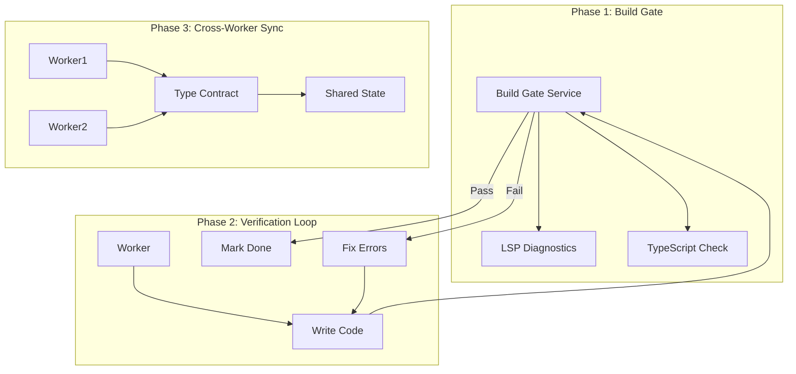
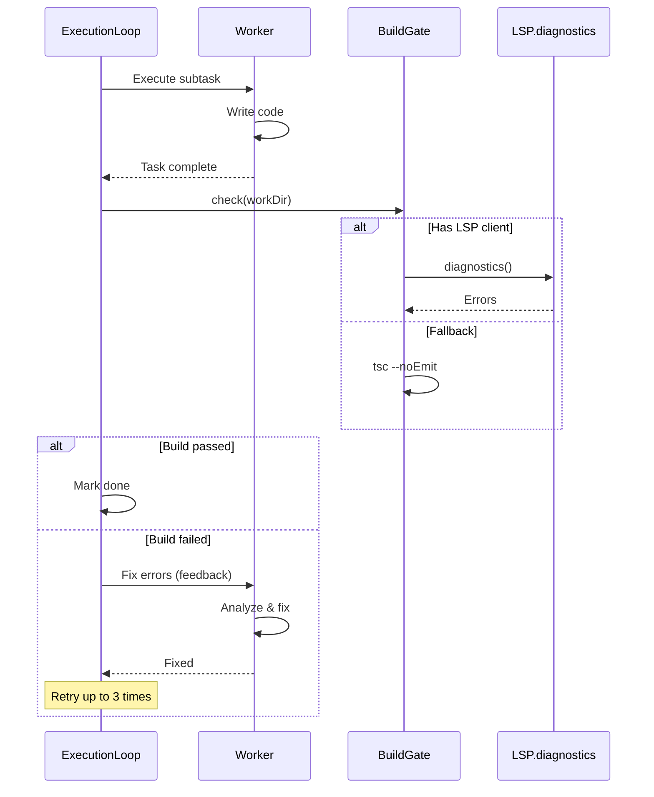

# 产出质量改进方案

基于 OpenCode 架构分析，结合 Tachikoma 现有问题，提出以下解决方案。

---

## 问题回顾

| 问题                 | 影响               | OpenCode 解决方案        |
| -------------------- | ------------------ | ------------------------ |
| Worker 不验证 Build  | 40+ TS 错误        | LSP 实时诊断             |
| 多 Worker 类型不协调 | 导入错误、类型缺失 | 共享状态 + subagent 模式 |
| 测试框架混用         | jest vs vitest     | 项目感知 + 一致性检查    |
| 任务完成无门控       | 错误累积           | Permission + Result 模式 |

---

## 解决方案架构



---

## Phase 1: Build Gate Service (P0 - 立即实施)

### 目标

Worker 完成代码编写后，必须通过 Build Gate 验证才能标记任务完成。

### 实现方案

#### 1.1 新增 `BuildGateService`

[packages/core/src/orchestrator/services/build-gate.ts](file:///Users/hjqcan/Documents/tachikoma/packages/core/src/orchestrator/services/build-gate.ts)
[NEW]

```typescript
export interface BuildGateResult {
  passed: boolean;
  errors: BuildError[];
  warnings: BuildError[];
}

export interface BuildError {
  file: string;
  line: number;
  column: number;
  message: string;
  severity: 'error' | 'warning';
}

export class BuildGateService {
  async check(workDir: string): Promise<BuildGateResult> {
    // 1. 检测项目类型 (TypeScript, Python, etc.)
    // 2. 运行对应的类型检查
    // 3. 收集错误并返回结构化结果
  }

  async checkTypeScript(workDir: string): Promise<BuildError[]> {
    // 运行 tsc --noEmit 并解析输出
  }

  async checkPython(workDir: string): Promise<BuildError[]> {
    // 运行 mypy 或 pyright
  }
}
```

#### 1.2 修改 `ExecutionLoop.executeSubtask`

[packages/core/src/orchestrator/runner/execution-loop.ts](file:///Users/hjqcan/Documents/tachikoma/packages/core/src/orchestrator/runner/execution-loop.ts)

在 Worker 完成后、标记任务完成前，调用 BuildGate：

```diff
 // Worker 执行完成后
 const result = await agent.execute(workerTask, options);

+// Build Gate 验证
+const buildResult = await this.buildGate.check(workDir);
+if (!buildResult.passed) {
+  // 将错误反馈给 Worker，要求修复
+  await this.requestWorkerFix(workerId, buildResult.errors);
+  continue; // 重新执行
+}

 // 标记任务完成
 this.state.markSubtaskCompleted(subtaskId, result);
```

---

## Phase 2: Verification Loop (P0 - 紧跟 Phase 1)

### 目标

Build 失败时，Worker 应自动修复错误并重试。

### 实现方案

#### 2.1 Error Feedback 机制

参考 OpenCode 的 `lsp_diagnostics` 工具模式：

```typescript
// 向 Worker 反馈错误，要求修复
async function feedbackErrorsToWorker(agent: Agent, errors: BuildError[]): Promise<TaskResult> {
  const errorSummary = errors.map((e) => `${e.file}:${e.line} - ${e.message}`).join('\n');

  const fixTask: Task = {
    type: 'atomic',
    objective: `Fix the following build errors:\n${errorSummary}`,
    constraints: ['Do not introduce new errors', 'Run tsc --noEmit after fixing'],
  };

  return agent.execute(fixTask, options);
}
```

#### 2.2 重试策略

```typescript
interface VerificationLoopConfig {
  maxRetries: number; // 默认 3
  buildGateEnabled: boolean;
  testGateEnabled: boolean;
}
```

---

## Phase 3: Cross-Worker Type Coordination (P1)

### 目标

解决多 Worker 并行时的类型不协调问题。

### 实现方案

#### 3.1 Type Contract 在 Planner 阶段定义

让 Planner 生成任务时，定义共享类型的接口契约：

```typescript
interface PlannerOutput {
  subtasks: SubTask[];
  roles: PlannerRole[];
  // NEW: 共享类型契约
  typeContracts?: TypeContract[];
}

interface TypeContract {
  path: string; // e.g., "src/types/music.ts"
  exports: string[]; // e.g., ["Artist", "Album", "Song"]
  requiredBy: string[]; // subtask IDs
}
```

#### 3.2 执行顺序调整

确保定义类型的任务先于使用类型的任务完成：

```typescript
// 在 ExecutionLoop 中
if (subtask.producesTypes) {
  // 优先执行类型定义任务
  await this.executeSubtask(subtask);
  // 等待 Build Gate 通过
  await this.buildGate.check(workDir);
}
```

---

## Phase 4: Project-Aware Configuration (P1)

### 目标

自动检测项目配置，避免 jest/vitest 混用等问题。

### 实现方案

#### 4.1 新增 `ProjectDetector` 服务

```typescript
export interface ProjectConfig {
  language: 'typescript' | 'javascript' | 'python';
  testFramework: 'jest' | 'vitest' | 'pytest' | 'mocha';
  buildCommand: string;
  testCommand: string;
}

export class ProjectDetector {
  async detect(workDir: string): Promise<ProjectConfig> {
    const packageJson = await this.readPackageJson(workDir);

    // 检测测试框架
    if (packageJson.scripts?.test?.includes('vitest')) {
      return { testFramework: 'vitest', ... };
    }
    if (packageJson.devDependencies?.jest) {
      return { testFramework: 'jest', ... };
    }
  }
}
```

#### 4.2 注入到 Worker Prompt

```typescript
// 在 Worker 系统提示中注入项目配置
const systemPrompt = `
You are working on a ${projectConfig.language} project.
Test framework: ${projectConfig.testFramework}
Use ${projectConfig.testFramework === 'vitest' ? 'vi.fn()' : 'jest.fn()'} for mocks.
`;
```

---

## 开发计划

### Week 1: Phase 1 - Build Gate Service

| 任务                                                                                                                            | 预估时间 | 优先级 |
| ------------------------------------------------------------------------------------------------------------------------------- | -------- | ------ |
| 实现 `BuildGateService`                                                                                                         | 2天      | P0     |
| 集成到 [ExecutionLoop](file:///Users/hjqcan/Documents/tachikoma/packages/core/src/orchestrator/runner/execution-loop.ts#35-506) | 1天      | P0     |
| 添加 TypeScript/Python 检查                                                                                                     | 1天      | P0     |
| 单元测试                                                                                                                        | 1天      | P0     |

### Week 2: Phase 2 - Verification Loop

| 任务                     | 预估时间 | 优先级 |
| ------------------------ | -------- | ------ |
| 实现 Error Feedback 机制 | 2天      | P0     |
| 实现重试策略             | 1天      | P0     |
| 集成测试                 | 1天      | P0     |
| 端到端测试               | 1天      | P0     |

### Week 3: Phase 3 & 4 - Coordination & Detection

| 任务                 | 预估时间 | 优先级 |
| -------------------- | -------- | ------ |
| 实现 Type Contract   | 2天      | P1     |
| 实现 ProjectDetector | 2天      | P1     |
| Planner 修改         | 1天      | P1     |

---

## 风险与缓解

| 风险                    | 缓解措施                                 |
| ----------------------- | ---------------------------------------- |
| Build Gate 增加执行时间 | 只在任务完成时检查，非每次文件写入       |
| 无限重试循环            | 设置 maxRetries=3，超过则标记失败        |
| 类型契约准确性          | 让 Planner 使用 LLM 生成，后续可迭代优化 |

---

## 成功指标

| 指标           | 当前 | 目标 |
| -------------- | ---- | ---- |
| Build 通过率   | 0%   | ≥90% |
| 测试通过率     | 0%   | ≥80% |
| 产出可直接运行 | ❌   | ✅   |

# 产出质量改进方案 (更新)

---

## 研究发现

### 1. LSP 模块状态 ❌ 未被 BuildGate 使用

Tachikoma 已有完整的 LSP 模块：

| 组件               | 路径                                                                                              | 功能                                 |
| ------------------ | ------------------------------------------------------------------------------------------------- | ------------------------------------ |
| LSP 核心           | [lsp/index.ts](file:///Users/hjqcan/Documents/tachikoma/packages/core/src/lsp/index.ts)           | 管理 LSP 服务器连接                  |
| lspTool            | [tools/core/lsp.ts](file:///Users/hjqcan/Documents/tachikoma/packages/core/src/tools/core/lsp.ts) | goToDefinition, references, hover 等 |
| lspDiagnosticsTool | [tools/core/lsp.ts](file:///Users/hjqcan/Documents/tachikoma/packages/core/src/tools/core/lsp.ts) | 获取文件诊断信息                     |

**问题**: LSP 模块未被
[BuildGateService](file:///Users/hjqcan/Documents/tachikoma/packages/core/src/orchestrator/services/build-gate.ts#61-374)
使用，当前使用 `tsc --noEmit` 代替。

**建议**: Phase 2 中集成 LSP.diagnostics() 以获得更快、更准确的错误检测。

---

### 2. shell_run 背景模式 ✅ 已实现

当前实现状态：

```typescript
// shell_run 已支持 background 模式
{
  command: "npm run dev",
  background: true  // ← 立即返回 PID，不阻塞
}
```

**问题**: Workers 可能不知道使用 `background: true`，导致 `npm run dev` 等命令超时卡死。

**OpenCode 对比**:

- OpenCode 使用 `run_in_background` 参数（功能相同）
- 默认 timeout 2分钟，可配置最高 10 分钟
- 背景进程可通过 Bash tool 查看输出

**建议**:

1. 在 Worker 系统提示中明确说明 `background: true` 用法
2. 自动检测 `npm run dev`, `yarn dev` 等命令并建议用 background 模式
3. 添加智能 timeout 警告

---

## Phase 2: Verification Loop (立即实施)

### 目标

Build Gate 失败时，将错误反馈给 Worker 并要求修复。

### 架构



### 实现步骤

#### 2.1 增强 BuildGateService 支持 LSP

```typescript
// 新增 checkWithLSP 方法
async checkWithLSP(
  workDir: string,
  changedFiles: string[]
): Promise<BuildGateResult> {
  // 1. 先用 LSP.diagnostics() 获取错误
  // 2. 如果 LSP 不可用，回退到 tsc --noEmit
}
```

#### 2.2 ExecutionLoop 集成 Verification Loop

```typescript
// 在 executeSubtask 成功后
const MAX_FIX_ATTEMPTS = 3;
let fixAttempts = 0;

while (true) {
  const result = await worker.execute(task);

  if (this.buildGateService) {
    const buildResult = await this.buildGateService.check(workDir);

    if (!buildResult.passed && fixAttempts < MAX_FIX_ATTEMPTS) {
      fixAttempts++;
      // 创建修复任务
      const fixTask = createFixTask(task, buildResult.errors);
      task = fixTask; // 继续循环
      continue;
    }
  }

  // 成功或超过重试次数
  break;
}
```

#### 2.3 创建 Fix Task 辅助函数

```typescript
function createFixTask(originalTask: WorkerTask, errors: BuildError[]): WorkerTask {
  const errorSummary = BuildGateService.formatErrorsForWorker({
    passed: false,
    errors,
    warnings: [],
    summary: `${errors.length} errors found`,
  });

  return {
    ...originalTask,
    objective: `Fix the following build errors:\n\n${errorSummary}`,
    constraints: [
      ...(originalTask.constraints ?? []),
      'Do not introduce new errors',
      'Run tsc --noEmit after fixing to verify',
    ],
  };
}
```

---

## 文件改动清单

### Phase 2: Verification Loop

| 文件                                                                                                                  | 改动                            |
| --------------------------------------------------------------------------------------------------------------------- | ------------------------------- |
| [build-gate.ts](file:///Users/hjqcan/Documents/tachikoma/packages/core/src/orchestrator/services/build-gate.ts)       | 增加 `checkWithLSP()` 方法      |
| [execution-loop.ts](file:///Users/hjqcan/Documents/tachikoma/packages/core/src/orchestrator/runner/execution-loop.ts) | 增加 verification loop 逻辑     |
| [execution-loop.ts](file:///Users/hjqcan/Documents/tachikoma/packages/core/src/orchestrator/runner/execution-loop.ts) | 增加 `createFixTask()` 辅助函数 |

### Phase 3: Worker 提示优化

| 文件             | 改动                                        |
| ---------------- | ------------------------------------------- |
| Worker 系统提示  | 添加 `background: true` 使用说明            |
| shell_run prompt | 自动检测 dev server 命令并提示用 background |

---

## 验证计划

1. **单元测试**: BuildGateService.checkWithLSP()
2. **集成测试**: ExecutionLoop verification loop
3. **端到端测试**: 用一个生成代码有错误的任务测试自动修复

是否继续实施 Phase 2？
