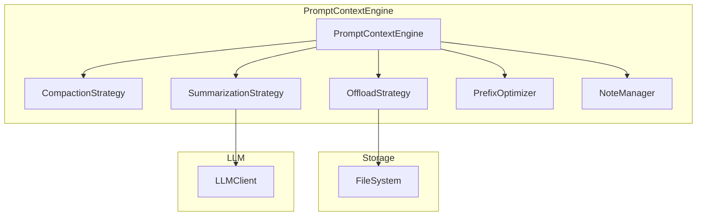

# 上下文工程模块实现总结

## 完成状态

✅ **所有 600+ 测试通过** ✅ **TypeScript 编译无错误** ✅ **Phase 1-7 + Task 8 全部完成**

---

## 创建的文件

```
packages/core/src/prompt/
├── index.ts                        # 模块主入口 (105 行)
├── types.ts                        # 核心类型定义 (360 行)
├── context-manager.ts              # 核心上下文管理器 (390 行)
├── strategies/
│   ├── index.ts                    # 策略模块入口
│   ├── compaction.ts               # 压缩策略 (385 行)
│   ├── summarization.ts            # 摘要策略 (327 行)
│   └── offload.ts                  # 卸载策略 (230 行)
├── cache/
│   ├── index.ts                    # 缓存模块入口
│   └── prefix-optimizer.ts         # KV 缓存优化器 (232 行)
└── memory/
    ├── index.ts                    # 记忆模块入口
    └── note-taking.ts              # 笔记系统 (280 行)
```

**总计**: ~2300 行代码

---

## 核心功能

### 1. 压缩策略 (Compaction)

**可逆压缩**：保留恢复标识符

```typescript
import { createCompactionStrategy, DEFAULT_COMPACTION_CONFIG } from '@tachikoma/core/internal/prompt';

const strategy = createCompactionStrategy(DEFAULT_COMPACTION_CONFIG);
const result = strategy.compact(messages, estimateTokens);

// result.gainRatio > 0.2 表示压缩有效
// result.recoveryRefs 包含恢复引用
```

**规则**：

- 工具调用：保留 `path`、`url`、`query` 等标识符
- 保留最后 N 条完整消息作为少样本示例

---

### 2. 摘要策略 (Summarization)

**结构化摘要**（来自 Manus 最佳实践）

```typescript
import { createSummarizationStrategy, DEFAULT_SUMMARIZATION_CONFIG } from '@tachikoma/core/internal/prompt';

const strategy = createSummarizationStrategy(DEFAULT_SUMMARIZATION_CONFIG);
const result = await strategy.summarize(messages, llmClient, estimateTokens);

// result.summary 是结构化摘要
```

**摘要 Schema**：

- `userGoal`: 用户目标
- `completedSteps`: 已完成步骤
- `keyFindings`: 关键发现
- `modifiedFiles`: 修改的文件
- `nextSteps`: 下一步计划

---

### 3. 卸载策略 (Offload)

**文件系统即上下文**

```typescript
import { createOffloadStrategy } from '@tachikoma/core/internal/prompt';

const strategy = createOffloadStrategy({
  workDir: '/path/to/work',
  tokenThreshold: 5000,
  fileFormat: 'jsonl',
});

const result = await strategy.offload(messages, fileManager, estimateTokens);
// result.filePaths 包含卸载的文件路径
```

---

### 4. KV 缓存优化

**提高缓存命中率**

```typescript
import { createPrefixOptimizer } from '@tachikoma/core/internal/prompt';

const optimizer = createPrefixOptimizer({
  deterministicSerialization: true,
  addCacheBreakpoints: true,
  forbiddenDynamicContent: ['timestamp', 'uuid'],
});

const optimizedContext = optimizer.optimize(messages);
const hitRate = optimizer.estimateCacheHitRate(previousMessages, currentMessages);
```

---

### 5. 笔记系统

**通过复述操控注意力**

```typescript
import { createNoteManager } from '@tachikoma/core/internal/prompt';

const noteManager = createNoteManager();
let notes = noteManager.createNotes();

notes = noteManager.addTodo(notes, '完成用户认证模块');
notes = noteManager.completeTodo(notes, todoId);

// 生成 Markdown
const markdown = noteManager.formatAsMarkdown(notes);

// 注入到上下文末尾（提升注意力）
const contextWithReminder = noteManager.injectIntoContext(notes, messages);
```

---

### 6. 核心 PromptContextEngine

**整合所有策略**

```typescript
import { createPromptContextEngine, createDefaultPromptConfig } from '@tachikoma/core/internal/prompt';

const config = createDefaultPromptConfig('/path/to/work');
const contextEngine = createPromptContextEngine(config, {
  llmClient, // 可选：用于摘要
  fileManager, // 可选：用于卸载
});

// 添加消息
contextEngine.addMessage({ id: '1', role: 'user', content: '...' });

// 检查是否需要缩减
if (contextEngine.needsReduction()) {
  await contextEngine.autoReduce(); // 自动选择压缩或摘要
}

// 获取优化后的上下文
const context = contextEngine.getContext();
```

---

## 来自 Manus 的核心原则

| 原则                 | 实现                                                                                                                                              |
| -------------------- | ------------------------------------------------------------------------------------------------------------------------------------------------- |
| **KV 缓存优先**      | [PrefixOptimizer](../packages/core/src/prompt/cache/prefix-optimizer.ts) 移除动态内容、确定性序列化 |
| **压缩可逆**         | [CompactionStrategy](../packages/core/src/prompt/strategies/compaction.ts) 保留 recoveryRef |
| **摘要结构化**       | [SummarizationStrategy](../packages/core/src/prompt/strategies/summarization.ts) 使用固定 Schema |
| **文件系统即上下文** | [OffloadStrategy](../packages/core/src/prompt/strategies/offload.ts) 卸载到文件 |
| **复述操控注意力**   | [NoteManager](../packages/core/src/prompt/memory/note-taking.ts) 待办事项系统 |

---

## 默认阈值配置（Manus 推荐）

```typescript
// 默认阈值（基于 Manus 最佳实践）
const DEFAULT_THRESHOLDS = {
  softLimit: 100_000, // 触发压缩
  hardLimit: 180_000, // 触发摘要
  rotThreshold: 128_000, // 上下文腐烂阈值
};

// 模型感知配置（Task 8 新增）
import { createModelAwarePromptConfig, computeModelAwareThresholds } from '@tachikoma/core/internal/prompt';

// 自动根据模型窗口计算阈值
const thresholds = computeModelAwareThresholds('claude-3-sonnet');
// thresholds.hardLimit = 160_000 (200K × 0.8)

// 创建完整配置
const config = createModelAwarePromptConfig('gpt-4o', '/path/to/work');
```

---

## Token 估算器（Task 8 新增）

**可插拔 Token 估算**

```typescript
import { createTokenEstimator, estimateTokens } from '@tachikoma/core/internal/prompt';

// 简单估算器（默认）
const simple = createTokenEstimator('simple');
simple.estimate('Hello World'); // ~4 tokens

// 字符感知估算器（中英文优化）
const charBased = createTokenEstimator('character-based');
charBased.estimate('你好世界'); // 中文估算更准确

// 在 PromptContextConfig 中使用自定义估算器
const config = createDefaultPromptConfig('/path');
config.tokenEstimator = (content) => myCustomEstimator(content);
```

---

## 后续集成

### 与 GenericAgentBackend 集成（Task 8 完成）

```typescript
// generic-agent-backend.ts 自动集成 PromptContextEngine（内部能力）

// 配置方式 1：通过 GenericBackendConfig
const backend = new GenericAgentBackend({
  llmClient,
  promptConfig: createModelAwarePromptConfig('claude-3-sonnet', workDir),
  workDir: '/path/to/work',
});

// 配置方式 2：使用默认配置（自动使用 Manus 推荐阈值）
const backend = new GenericAgentBackend({ llmClient });

// 执行时自动处理：
// 1. 每轮 LLM 调用前检查 needsReduction()
// 2. 超过软限制自动 autoReduce()
// 3. autoReduce 失败后尝试最多 3 轮 compact()
// 4. 超过硬限制中止执行并返回 CONTEXT_OVERFLOW 错误
// 5. 成功压缩后注入 statusReminder 帮助 agent 理解上下文变化
```

---

### Memory 系统接口（Task 9 预留）

```typescript
import { createPromptContextEngine, type MemoryProvider, type MemoryEntry } from '@tachikoma/core/internal/prompt';

// 实现 MemoryProvider 接口（Task 9 实现）
const memoryProvider: MemoryProvider = {
  async retrieve(query, topK, scope) { ... },
  async save(entry) { ... },
  async search(contextMessages, topK) { ... },
  async delete(id) { ... },
  async clear(scope) { ... },
};

// 注入到 PromptContextEngine
const engine = createPromptContextEngine(config, { memoryProvider });

// 检查是否需要记忆检索
if (engine.shouldRetrieveMemories()) {
  const retrievalContext = engine.getRetrievalContext();
  const memories = await memoryProvider.retrieve(retrievalContext);
  engine.injectRetrievedMemories(memories);
}
```

---

## 架构图



---

## 测试结果

```
✓ 728+ pass
✓ 0 fail
✓ TypeScript 编译无错误
✓ 20 context-integration tests
✓ 19 worker-backend tests
```

---

## Task 8 变更总结

| 功能                         | 说明                                                 |
| ---------------------------- | ---------------------------------------------------- |
| **模型感知阈值**             | `computeModelAwareThresholds()` 根据模型窗口自动计算 |
| **Token 估算器**             | 可插拔设计，支持 simple/character-based              |
| **GenericAgentBackend 集成** | 直接使用 PromptContextEngine，提供 `promptConfig` 覆盖 |
| **硬限制兜底**               | 超限时中止执行，防止模型上下文溢出                   |
| **Memory 接口预留**          | MemoryProvider/MemoryEntry 为 Task 9 准备            |
