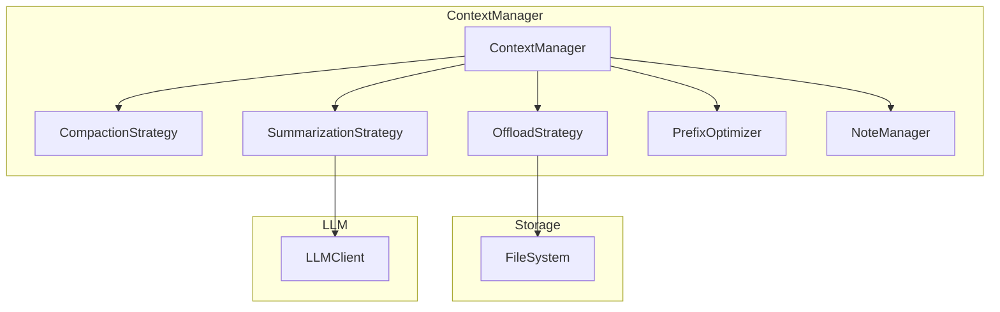

# 上下文工程模块实现总结

## 完成状态

✅ **所有 600 个测试通过**
✅ **TypeScript 编译无错误**
✅ **Phase 1-7 全部完成**

---

## 创建的文件

```
packages/core/src/context/
├── index.ts                        # 模块主入口 (105 行)
├── types.ts                        # 核心类型定义 (360 行)
├── context-manager.ts              # 核心上下文管理器 (390 行)
├── strategies/
│   ├── index.ts                    # 策略模块入口
│   ├── compaction.ts               # 压缩策略 (385 行)
│   ├── summarization.ts            # 摘要策略 (327 行)
│   └── offload.ts                  # 卸载策略 (230 行)
├── cache/
│   ├── index.ts                    # 缓存模块入口
│   └── prefix-optimizer.ts         # KV 缓存优化器 (232 行)
└── memory/
    ├── index.ts                    # 记忆模块入口
    └── note-taking.ts              # 笔记系统 (280 行)
```

**总计**: ~2300 行代码

---

## 核心功能

### 1. 压缩策略 (Compaction)

**可逆压缩**：保留恢复标识符

```typescript
import { createCompactionStrategy, DEFAULT_COMPACTION_CONFIG } from '@tachikoma/core/context';

const strategy = createCompactionStrategy(DEFAULT_COMPACTION_CONFIG);
const result = strategy.compact(messages, estimateTokens);

// result.gainRatio > 0.2 表示压缩有效
// result.recoveryRefs 包含恢复引用
```

**规则**：
- 工具调用：保留 `path`、`url`、`query` 等标识符
- 保留最后 N 条完整消息作为少样本示例

---

### 2. 摘要策略 (Summarization)

**结构化摘要**（来自 Manus 最佳实践）

```typescript
import { createSummarizationStrategy, DEFAULT_SUMMARIZATION_CONFIG } from '@tachikoma/core/context';

const strategy = createSummarizationStrategy(DEFAULT_SUMMARIZATION_CONFIG);
const result = await strategy.summarize(messages, llmClient, estimateTokens);

// result.summary 是结构化摘要
```

**摘要 Schema**：
- `userGoal`: 用户目标
- `completedSteps`: 已完成步骤
- `keyFindings`: 关键发现
- `modifiedFiles`: 修改的文件
- `nextSteps`: 下一步计划

---

### 3. 卸载策略 (Offload)

**文件系统即上下文**

```typescript
import { createOffloadStrategy } from '@tachikoma/core/context';

const strategy = createOffloadStrategy({
  workDir: '/path/to/work',
  tokenThreshold: 5000,
  fileFormat: 'jsonl',
});

const result = await strategy.offload(messages, fileManager, estimateTokens);
// result.filePaths 包含卸载的文件路径
```

---

### 4. KV 缓存优化

**提高缓存命中率**

```typescript
import { createPrefixOptimizer } from '@tachikoma/core/context';

const optimizer = createPrefixOptimizer({
  deterministicSerialization: true,
  addCacheBreakpoints: true,
  forbiddenDynamicContent: ['timestamp', 'uuid'],
});

const optimizedContext = optimizer.optimize(messages);
const hitRate = optimizer.estimateCacheHitRate(previousMessages, currentMessages);
```

---

### 5. 笔记系统

**通过复述操控注意力**

```typescript
import { createNoteManager } from '@tachikoma/core/context';

const noteManager = createNoteManager();
let notes = noteManager.createNotes();

notes = noteManager.addTodo(notes, '完成用户认证模块');
notes = noteManager.completeTodo(notes, todoId);

// 生成 Markdown
const markdown = noteManager.formatAsMarkdown(notes);

// 注入到上下文末尾（提升注意力）
const contextWithReminder = noteManager.injectIntoContext(notes, messages);
```

---

### 6. 核心 ContextManager

**整合所有策略**

```typescript
import { 
  createContextManager, 
  createDefaultContextConfig 
} from '@tachikoma/core/context';

const config = createDefaultContextConfig('/path/to/work');
const contextManager = createContextManager(config, {
  llmClient,      // 可选：用于摘要
  fileManager,    // 可选：用于卸载
});

// 添加消息
contextManager.addMessage({ id: '1', role: 'user', content: '...' });

// 检查是否需要缩减
if (contextManager.needsReduction()) {
  await contextManager.autoReduce(); // 自动选择压缩或摘要
}

// 获取优化后的上下文
const context = contextManager.getContext();
```

---

## 来自 Manus 的核心原则

| 原则 | 实现 |
|------|------|
| **KV 缓存优先** | [PrefixOptimizer](file:///Users/hjqcan/Documents/tachikoma/packages/core/src/context/cache/prefix-optimizer.ts#33-221) 移除动态内容、确定性序列化 |
| **压缩可逆** | [CompactionStrategy](file:///Users/hjqcan/Documents/tachikoma/packages/core/src/types.ts#334-335) 保留 recoveryRef |
| **摘要结构化** | [SummarizationStrategy](file:///Users/hjqcan/Documents/tachikoma/packages/core/src/context/strategies/summarization.ts#77-313) 使用固定 Schema |
| **文件系统即上下文** | [OffloadStrategy](file:///Users/hjqcan/Documents/tachikoma/packages/core/src/context/strategies/offload.ts#47-250) 卸载到文件 |
| **复述操控注意力** | [NoteManager](file:///Users/hjqcan/Documents/tachikoma/packages/core/src/context/memory/note-taking.ts#26-296) 待办事项系统 |

---

## 默认阈值配置

```typescript
const DEFAULT_THRESHOLDS = {
  softLimit: 100_000,   // 触发压缩
  hardLimit: 180_000,   // 触发摘要
  rotThreshold: 128_000 // 上下文腐烂阈值
};
```

---

## 后续集成

### 与 GenericAgentBackend 集成

```typescript
// 在 GenericAgentBackend.execute() 中
async *execute(options) {
  // 每轮迭代检查上下文
  if (this.contextManager.needsReduction()) {
    await this.contextManager.autoReduce();
  }
  
  const context = this.contextManager.getContext();
  // 继续 LLM 调用...
}
```

---

## 架构图



---

## 测试结果

```
✓ 600 pass
✓ 0 fail
✓ TypeScript 编译无错误
```
