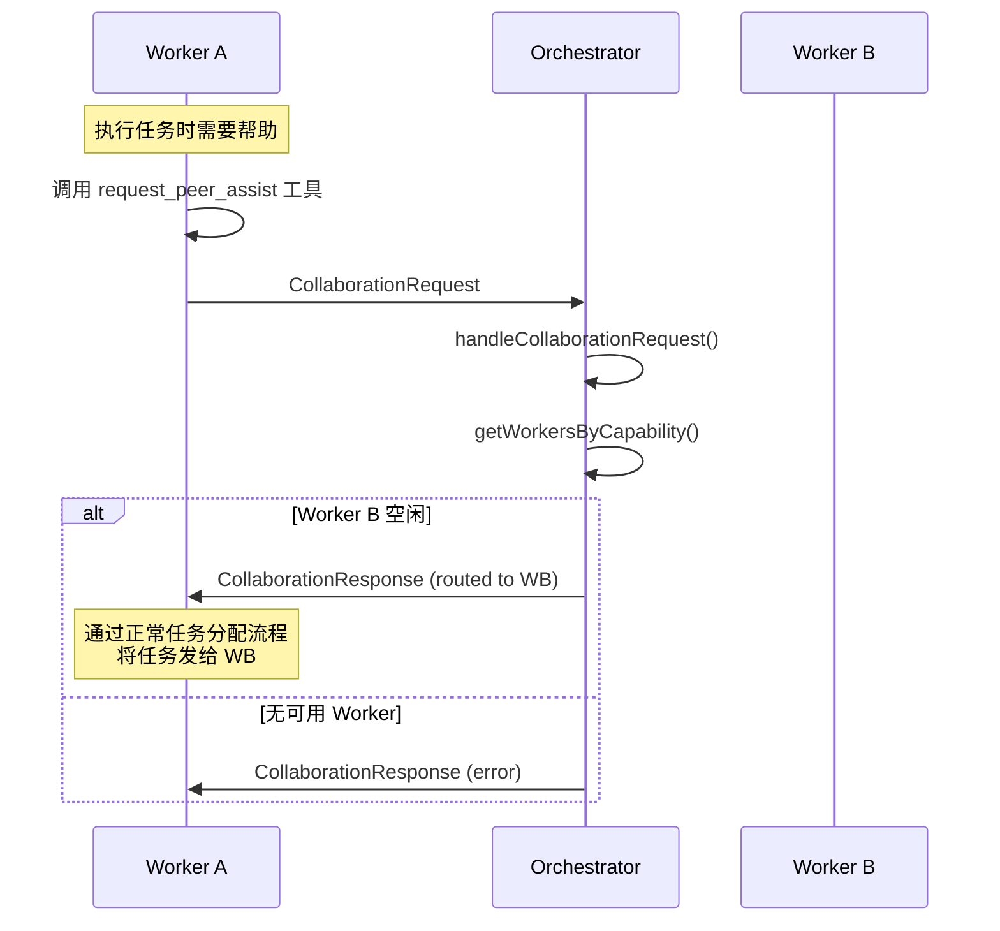

# Multi-Agent 协作协议

> 支持 P2P 通信、Request-Response、Pub-Sub、Blackboard 模式的多 Agent 协作

## 概述

协作模块提供了一套完整的 Agent 间通信基础设施，支持：

- **Agent 发现** - 注册、心跳、能力过滤
- **Request-Response** - 同步请求响应，支持优先级队列
- **Pub-Sub** - 事件发布订阅，支持通配符匹配
- **Blackboard** - 共享状态存储，支持 CAS 和 TTL

## 架构

```
┌─────────────────────────────────────────────────────────────┐
│                   CollaborationManager                       │
│  ┌──────────────┐ ┌──────────────┐ ┌──────────────┐         │
│  │ AgentRegistry│ │MessageBroker │ │  PubSubHub   │         │
│  └──────────────┘ └──────────────┘ └──────────────┘         │
│  ┌──────────────┐                                           │
│  │  Blackboard  │                                           │
│  └──────────────┘                                           │
└─────────────────────────────────────────────────────────────┘
          │                    │                    │
          ▼                    ▼                    ▼
    ┌──────────┐        ┌──────────┐        ┌──────────┐
    │   File   │        │   File   │        │  Redis   │
    │ Backend  │        │ Backend  │        │ Backend  │
    └──────────┘        └──────────┘        └──────────┘
```

## 快速开始

### 基础使用

```typescript
import { CollaborationManager, createPeerAssistTool } from '@tachikoma/core';

// 创建管理器（文件后端）
const manager = new CollaborationManager({
  backend: 'file',
  rootDir: '.tachikoma',
});

// 启动并注册 Agent
await manager.start('worker-1', {
  sessionId: 'session-1',
  type: 'worker',
  capabilities: ['code', 'review'],
  status: 'online',
  priority: 5,
});

// 发现其他 Peers
const peers = await manager.discoverPeers(['code']);
console.log(
  'Found peers:',
  peers.map((p) => p.agentId)
);

// 请求协助
const response = await manager.requestAssist(
  'worker-2',
  { task: 'review code' },
  5 // priority
);

// 停止
await manager.stop();
```

### 作为工具使用

```typescript
import { createPeerAssistTool } from '@tachikoma/core';

// 创建工具
const peerAssistTool = createPeerAssistTool(collaborationManager);

// 工具会自动发现合适的 Peer 并发送请求
const result = await peerAssistTool.execute({
  requiredCapabilities: ['review'],
  taskDescription: '请帮我 Review 这段代码',
  taskPayload: { file: 'src/main.ts', lines: '1-50' },
  priority: 8,
});
```

## 组件详解

### AgentRegistry

Agent 发现与注册服务。

```typescript
// 注册
await registry.register({
  agentId: 'worker-1',
  sessionId: 'session-1',
  type: 'worker',
  capabilities: ['code'],
  status: 'online',
  priority: 5,
});

// 查询
const workers = await registry.listAgents({
  type: 'worker',
  status: 'online',
  capabilities: ['code'],
});

// 心跳
await registry.heartbeat('worker-1');

// 监听变更
registry.onAgentChange((agent, event) => {
  console.log(`Agent ${agent.agentId} ${event}`);
});
```

### MessageBroker

Request-Response 消息传递，支持优先级队列。

```typescript
// 发送请求并等待响应
const response = await broker.request({
  fromAgentId: 'worker-1',
  toAgentId: 'worker-2',
  type: 'assist',
  payload: { task: 'help' },
  timeout: 30000,
  priority: 5, // 高优先级会插队
});

// 监听请求
broker.onRequest(async (request) => {
  return {
    success: true,
    payload: { result: 'done' },
  };
});
```

### PubSubHub

事件发布订阅。

```typescript
import { BUILTIN_TOPICS } from '@tachikoma/core';

// 订阅
pubsub.subscribe(BUILTIN_TOPICS.TASK_COMPLETED, (event) => {
  console.log('Task completed:', event.payload);
});

// 通配符订阅
pubsub.subscribePattern('task:*', (event) => {
  console.log('Task event:', event.topic);
});

// 发布
await pubsub.publish(BUILTIN_TOPICS.TASK_COMPLETED, {
  taskId: 'task-1',
  result: 'success',
});
```

### Blackboard

共享状态存储。

```typescript
// 设置（带 TTL）
await blackboard.set('shared:config', { theme: 'dark' }, 3600);

// 获取
const config = await blackboard.get<{ theme: string }>('shared:config');

// 原子 Compare-And-Set
const success = await blackboard.compareAndSet('counter', expectedVersion, newValue);

// 监听变更
blackboard.watch('shared:config', (entry) => {
  console.log('Config updated:', entry.value);
});
```

## 后端选择

### File 后端（默认）

- 适用于单机/单 Session
- 无需额外依赖
- 使用文件系统进行 IPC

```typescript
new CollaborationManager({
  backend: 'file',
  rootDir: '.tachikoma',
});
```

### Redis 后端 (⚠️ Experimental)

> **注意**:
> Redis 后端需要外部注入 client，不通过 CollaborationManager 自动接线。目前仅 File 后端完整支持。

- 适用于跨 Session/分布式
- 需要 Redis 服务器
- 低延迟实时通信

```typescript
// 直接使用工厂函数创建 Redis 组件
import { createRedisAgentRegistry, createRedisMessageBroker } from '@tachikoma/core';

const registry = createRedisAgentRegistry(
  {
    url: 'redis://localhost:6379',
  },
  yourRedisClient
);
```

## 内置主题

```typescript
const BUILTIN_TOPICS = {
  TASK_COMPLETED: 'task:completed',
  TASK_FAILED: 'task:failed',
  ARTIFACT_CREATED: 'artifact:created',
  AGENT_JOINED: 'agent:joined',
  AGENT_LEFT: 'agent:left',
  AGENT_STATUS_CHANGED: 'agent:status_changed',
};
```

## 优先级机制

请求支持 0-10 的优先级：

- **0-3**: 低优先级（后台任务）
- **4-6**: 普通优先级
- **7-10**: 高优先级（可插队，但不打断正在执行的任务）

```typescript
await broker.request({
  // ...
  priority: 10, // 最高优先级
});
```

## 与 GenericAgentBackend 集成

在配置中启用协作：

```typescript
const backend = new GenericAgentBackend({
  // ...
  collaborationConfig: {
    enabled: true,
    agentId: 'worker-1',
    capabilities: ['code', 'review'],
    // rootDir 默认为 .tachikoma，与 Orchestrator 保持一致
  },
});
```

启用后，Worker 会自动获得 `request_peer_assist` 工具。

### `request_peer_assist` 的路由语义（协议收敛）

为避免 “assign 只是占位但看起来像执行了” 的假阳性，协作请求默认采用 **Orchestrator 路由**：

- Worker 调用 `request_peer_assist` → 请求发给 Orchestrator
- Orchestrator 选择合适的 Worker，并返回 `targetWorkerId`
- **实际执行由调用方自行协调**（例如把子任务通过正常的任务分配流程投递给该 worker）

`PeerAssistInput.targetAgentId` 的语义做了最小侵入收敛：

- 如果它指向 `orchestrator` 类型的 Agent：视为指定路由器（router）
- 否则：视为 `preferredWorkerId`（路由约束/偏好），由 Orchestrator 决策；可配合 `strictTarget: true` 要求必须命中

## 与 Orchestrator 集成

```typescript
const orchestrator = new Orchestrator('orch-1', {
  config: {
    collaborationConfig: {
      enabled: true,
    },
  },
});
```

Orchestrator 会自动注册为 `orchestrator` 类型的 Agent，并：

1. **自动传递配置给 Worker** - 创建 Worker 时会自动传递协作配置，确保使用相同的 `rootDir`
2. **注册请求处理器** - 作为协作中心，接收 Worker 的协作请求并路由到合适的 Worker
3. **发出协作事件** -
   `collaboration:request_received`、`collaboration:request_routed`、`collaboration:request_completed`

### 协作流程



## 故障排查

### Worker 无法互相发现

1. **检查 rootDir 一致性** - 确保所有 Agent 使用相同的 `rootDir`（默认 `.tachikoma`）
2. **检查协作是否启用** - 确认 `collaborationConfig.enabled: true`
3. **检查 session 目录** - 查看 `.tachikoma/collaboration/registry/` 下是否有 Agent 注册文件

### 请求超时

1. **检查目标 Agent 状态** - 目标可能已离线或处于 busy 状态
2. **增加超时时间** - 默认 30 秒，可通过 `timeout` 参数调整
3. **检查请求处理器** - 确认目标 Agent 已注册 `onRequest` 处理器

## 类型导出

```typescript
export type {
  AgentType,
  AgentStatus,
  AgentRegistration,
  CollaborationRequest,
  CollaborationResponse,
  CollaborationEvent,
  BlackboardEntry,
  CollaborationConfig,
  IAgentRegistry,
  IMessageBroker,
  IPubSubHub,
  IBlackboard,
  ICollaborationManager,
} from '@tachikoma/core';
```
